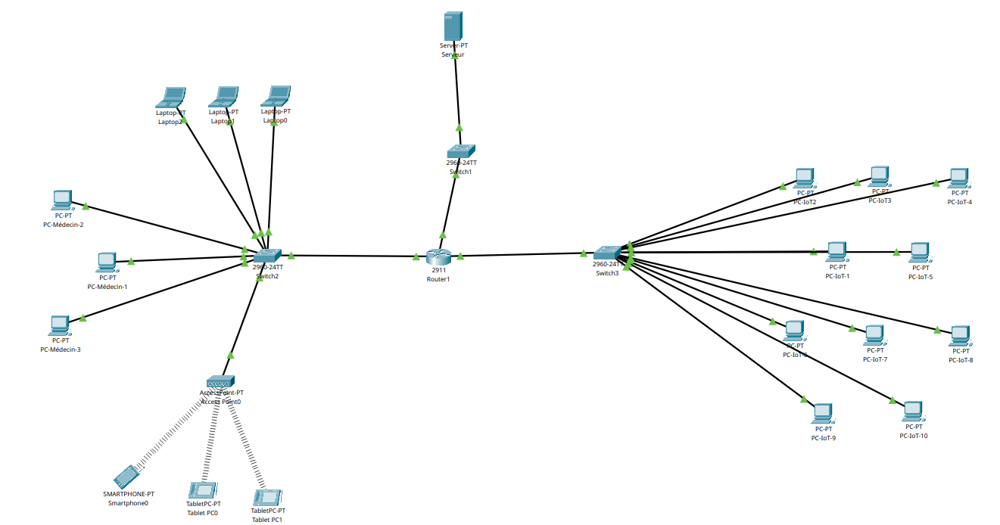

  

  # 🏥 Smart Hospital Security Lab

  
  
  
  
  

---

## 📋 Table des matières
- [Objectif](#-objectif)
- [Topologie](#-topologie)
- [Adressage](#-table-dadressage)
- [Services](#-services-configurés)
- [ACL](#-politique-de-sécurité)
- [Tests](#-résultats-des-tests)
- [Concepts](#-concepts-démontrés)

---

## 🎯 Objectif
Simuler un réseau hospitalier sécurisé avec 3 zones isolées (Médecins, IoT Médical, Serveurs), un serveur DHCP/DNS centralisé, et des ACL pour contrôler les flux entre zones.

---

## 🖧 Topologie

